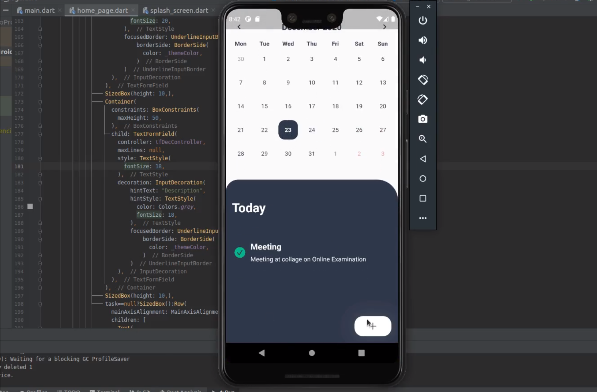

# Todo List App in Flutter

With the help of this application you can manage your daily tasks.

# Features

* Create a Task
* Edit a Task 
* Mark as Completed
* Delete a Task
* Attractive UI

# Youtube Demo

# Screen Shots

   
    
    
    

# Created by

[Ajaysinh Rathod](https://github.com/Ajaysinh1290)

Email : ajaysinhrathod1290@gmail.com

# Social Media Accounts
&nbsp; &nbsp; &nbsp; &nbsp; &nbsp;
&nbsp; &nbsp; &nbsp; &nbsp; &nbsp; 
&nbsp; &nbsp; &nbsp; &nbsp; &nbsp; 

